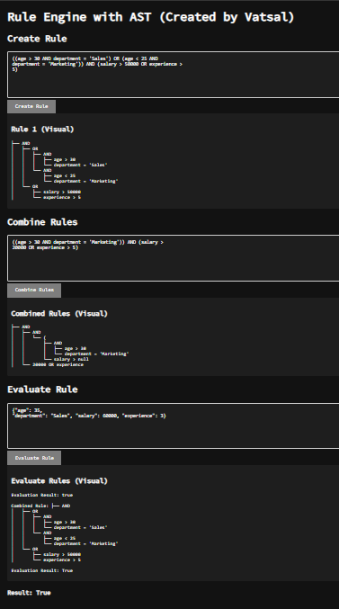

# Rule Engine with AST (Abstract Syntax Tree)

This project implements a **Rule Engine** using Abstract Syntax Trees (AST). The engine allows users to define rules, combine them, and evaluate these rules against a set of data. It also includes a visual representation of the rule structure and a typing effect for the header.

## Features

- **Rule Creation**: Users can define individual rules using standard comparison and logical operators.
- **Rule Combination**: Multiple rules can be combined using logical operators (AND, OR) to form complex conditions.
- **Evaluation**: The combined rules can be evaluated against a provided JSON dataset, returning either `True` or `False` based on the evaluation.
- **AST Visualization**: Rules are parsed into an Abstract Syntax Tree, and a visual representation is displayed.
- **Typing Effect**: The header displays a typing effect for a more engaging user experience.

---

## Table of Contents

- [Demo](#demo)
- [Installation](#installation)
- [Usage](#usage)
  - [Rule Creation](#rule-creation)
  - [Combining Rules](#combining-rules)
  - [Evaluating Rules](#evaluating-rules)
- [Technologies Used](#technologies-used)
- [Test Case Inputs for Rule Engine](#test-case-inputs-for-rule-engine)

---

## Demo

### Live Preview
[Live Website Link](https://vatsalpatel1123.github.io/Rule-Engine-using-AST/)



---

## Installation

1. **Clone the repository:**

   ```bash
   git clone https://vatsalpatel1123/Rule-Engine-using-AST/rule-engine-ast.git
   cd Rule-Engine-using-AST

## Usage

### 1. Rule Creation

- **Step 1**: In the **Rule Input** section, enter a rule using logical and comparison operators. Example:

  ```text
  (age > 30 AND department = 'Sales')

- **Step 2**: Click the Create Rule button to generate an Abstract Syntax Tree (AST) for the rule. The visual representation of the tree will be shown below the input.

### 2. Combining Rules
- **Step 1**: After creating rules, enter additional rules in the Combined Rule Input section.

- **Step 2**: Click the Combine Rules button. The AST of the combined rules will be displayed.

### 3. Evaluating Rules
- **Step 1**: In the Data Input section, enter a JSON object with the data you want to evaluate against the rules. Example:
```json
{
  "age": 35,
  "department": "Sales",
  "salary": 60000,
  "experience": 3
}
```
- **Step 2**: Click the Evaluate Rule button. The system will return either True or False based on the rule evaluation.

### Technologies Used
- HTML: For structuring the web interface.
- CSS: For styling the application (including dark mode).
- JavaScript: For the rule creation, evaluation logic, and AST generation.
- SweetAlert2: For alert popups (success or error messages).
- Google Fonts (Source Code Pro): For a clean, developer-friendly look.

# Test Case Inputs for Rule Engine

### Test Case 1: Simple Rule
**Input:**
```text
  ((age > 30 AND department = 'Sales') OR (age < 25 AND
department = 'Marketing')) AND (salary > 50000 OR experience >
5)
```
**Combine Rule:**
```text
  ((age > 30 AND department = 'Marketing')) AND (salary >
20000 OR experience > 5)
```
**Evaluate Rule:**
```json
 {"age": 35,
"department": "Sales", "salary": 60000, "experience": 3}
```
**Expected Output:**
```json
├── AND
│   ├── OR
│   │   ├── AND
│   │   │   ├── age > 30
│   │   │   └── department = 'Sales'
│   │   └── AND
│   │       ├── age < 25
│   │       └── department = 'Marketing'
│   └── OR
│       ├── salary > 50000
│       └── experience > 5

Result: True
```


